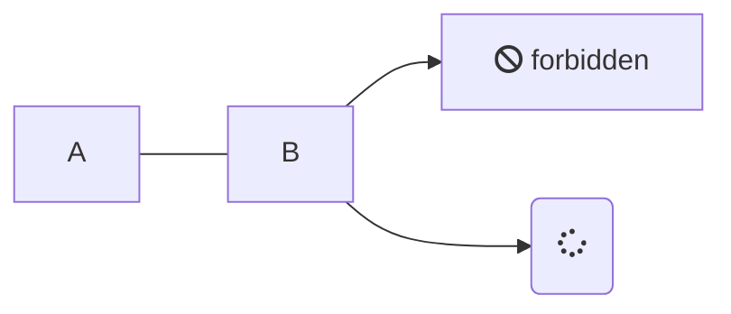

# Headline

> An awesome project.

## Section X


## Code Highlight

```java
public class Hoge {
  public static void main(String... args) {
    System.out.println("hello world");
  }
}
```

!> 重要

?> TIPS

## flexible-alerts

> [!NOTE]
> An alert of type 'note' using global style 'callout'.

> [!TIP]
> An alert of type 'tip' using global style 'callout'.

> [!WARNING]
> An alert of type 'warning' using global style 'callout'.

> [!ATTENTION]
> An alert of type 'attention' using global style 'callout'.
