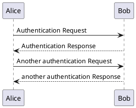

# Headline

> An awesome project.

### Section X

```plantuml
@startuml
Alice -> Bob: Authentication Request
Bob --> Alice: Authentication Response

Alice -> Bob: Another authentication Request
Alice <-- Bob: another authentication Response
@enduml
```

### Code Highlight
```java
public class Hoge {
  public static void main(String... args) {
    System.out.println("hello world");
  }
}
```
